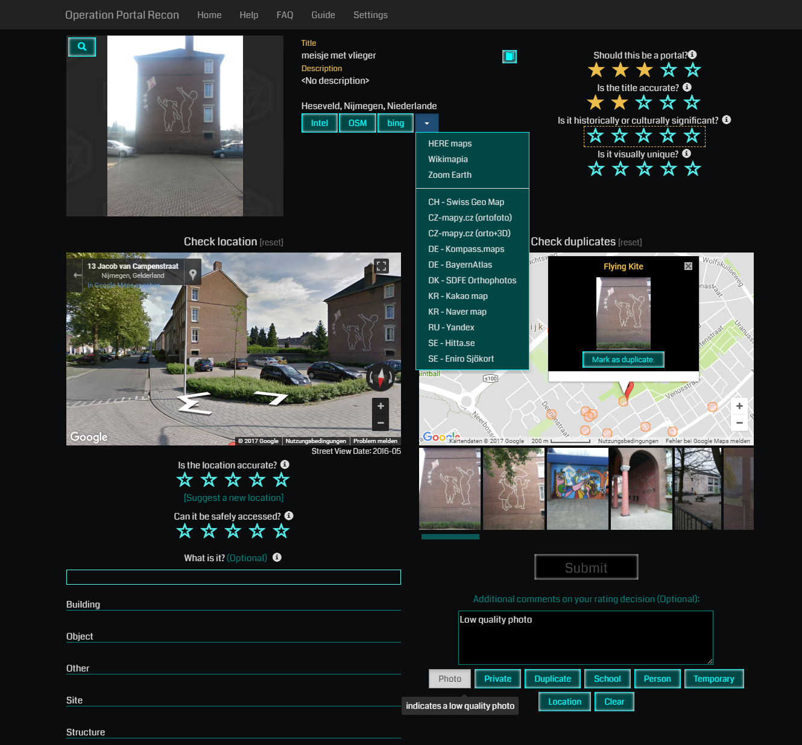
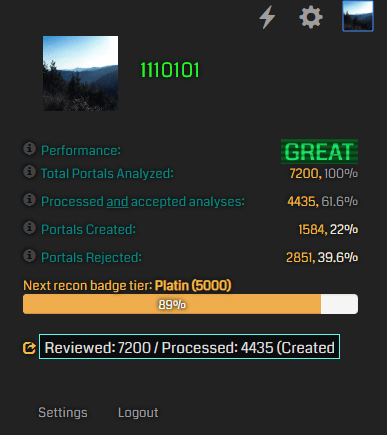

# OPR Tools
Userscript for [Ingress Operation Portal Recon](https://opr.ingress.com/recon)
> **Download:** https://gitlab.com/1110101/opr-tools/raw/master/opr-tools.user.js

## Features:
- Additional links to map services like Intel, OpenStreetMap, bing and some national ones
- Disabled annoying automatic page scrolling
- Automatically opens the first listed possible duplicate and the "What is it?" filter text box
- Buttons below the comments box to auto-type common 1-star rejection reasons
- Percent of total reviewed candidates processed
- Translate text buttons for title and description
- Moved overall portal rating to same group as other ratings
- Changed portal markers to small circles, inspied by IITC style
- Made "Nearby portals" list and map scrollable with mouse wheel
- **Keyboard navigation (See below)**

## Keyboard Navigation

You can use keyboard to fully control the page as follows:

|           Key(s)           |                 Function                 |
| :------------------------: | :--------------------------------------: |
|    Keys 1-5, Numpad 1-5    | Valuate current selected field (the red highlighted one) |
|             D              | Mark current candidate as a duplicate of the opened portal in "duplicates" |
| Space, Enter, Numpad Enter |     Confirm dialog / Send valuation      |
|       Tab, Numpad +        |                Next field                |
| Shift, Backspace, Numpad - |              Previous field              |
|       Esc, Numpad /        |               First field                |